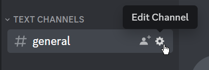
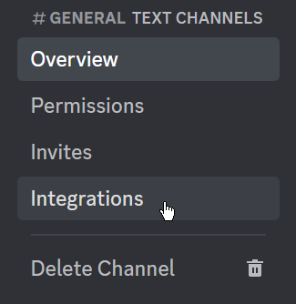
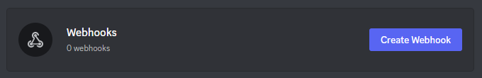
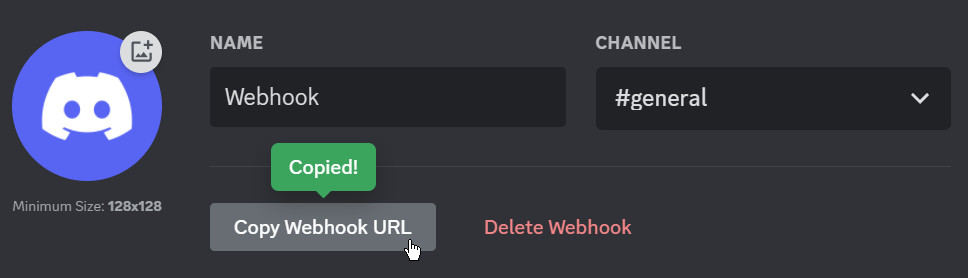
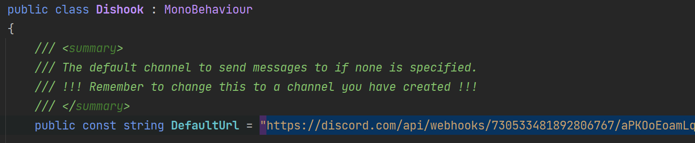
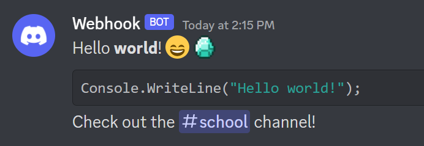

# Setting up Dishooks

## Creating your first webhook

To use Dishooks you will need at least one Discord webhook placed in the Dishook wrapper class. To create a webhook, follow these steps:

1. Open Discord and go to the channel you want to send messages to.
2. Right-click the channel name and select "Edit channel".


3. A new window will open. Click "Integrations" and then "Create Webhook".


    

4. Yet another window will open. Give the webhook a name, avatar and click "Create Webhook".


5. Open Unity and navigate to the Dishooks folder in the Project window. Open the `Dishooks/Scripts/Dishook.cs` class and paste the webhook URL into the `DefaultUrl` field.

6. You're done! You can now send messages to Discord from your Unity game. Visit the `Dishooks/Example/Dishook examples` scene to see how it works.

## Sending your first message
Sending messages using Dishooks is easy. If you "just" want to send a message, you can use the `Dishook.Send(string message);` wrapper method.
    
```csharp
Dishook.Send("Hello world!");
```

This will send a message to the default webhook URL you specified earlier, using the default username and avatar you specified in step 4. This method supports everything that can be sent by an user:
- **Discord markdown formatting**: you can style your text with bold, italics, underlines, strikethrough, code blocks, and more. 
- **Discord mentions**: you can mention users, roles, and channels.
- **Discord emotes**: you can use emojis from **any** server.

```csharp
Dishook.Send("Hello **world**! :smile: <:Diamond:426012569757810709>");

Dishook.Send("```csharp\nConsole.WriteLine(\"Hello world!\");```");

Dishook.Send("Check out the <#123456789012345678> channel!");
```

